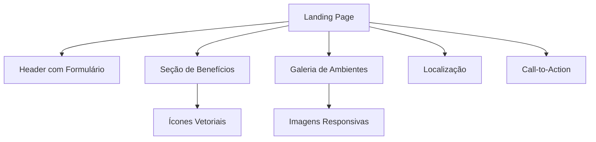

# InDecor - Template de Landing Page para Eventos de Design de Interiores ✨

  
*((Imagem ilustrativa do template))*
---

## 📌 Descrição do Projeto

O **InDecor** é um template profissional de landing page desenvolvido especialmente para eventos na área de design de interiores e decoração. Este projeto oferece:

- Design moderno e sofisticado com paleta de cores elegante
- Layout otimizado para conversão de inscrições
- Estrutura modular fácil de personalizar
- Exemplo completo com conteúdo fictício para demonstração

> 💡 **Destaque:**  
> Apesar de usar o conceito de evento de decoração como exemplo, o template foi projetado para ser **100% adaptável** a qualquer tipo de evento, workshop ou curso online.

---

## 🎯 Funcionalidades Principais

### 🖥 Seções Estratégicas
- **Cabeçalho impactante** com chamada principal
- **Formulário de captação** otimizado
- **Benefícios em destaque** com ícones visuais
- **Galeria de ambientes** decorados
- **Localização** com mapa integrado
- **Call-to-Action** final

### ✨ Recursos Especiais
- **Dark Mode automático** 🌓
- **Ícones premium** do Bootstrap Icons
- **Tipografia profissional** (Montserrat)
- **Design responsivo** para todos dispositivos
- **Favicon personalizado**
- **Efeitos de hover** suaves

### 📱 Mobile-First
- Menu adaptável
- Imagens responsivas
- Formulário mobile-friendly
- Botões de tamanho adequado

---

## 🛠 Tecnologias Utilizadas

| Categoria       | Tecnologias                                                                 |
|-----------------|-----------------------------------------------------------------------------|
| Frontend        |   |
| Design          |   |
| Responsividade  | Media Queries CSS, Flexbox, Grid Layout                                    |
| Performance     | Imagens otimizadas, CSS minificado                                        |

---

## 📂 Estrutura de Arquivos

```
indecor-landing/
├── index.html            # Página principal
├── css/
│   ├── reset.css         # Reset de estilos
│   ├── styles.css        # Estilos principais
│   └── responsive.css    # Media queries
├── img/
│   ├── hrz-1.jpg         # Imagens de background
│   ├── hrz-3.jpg         # Imagens de ambientes
│   ├── sqr-1.jpg         # Thumbnails
│   └── favicon.ico       # Ícone do site
└── README.md             # Documentação
```

---

## 🚀 Como Utilizar

### 1. Clone o repositório
```bash
git clone https://github.com/seu-usuario/indecor-landing.git
```

### 2. Personalização Básica
Edite os seguintes arquivos:
- `index.html` → Conteúdo e estrutura
- `css/styles.css` → Cores e estilos
- Substitua imagens na pasta `/img`

### 3. Integrações Avançadas (opcional)
- Conecte o formulário a um serviço como Formspree ou Mailchimp
- Adicione Google Analytics
- Implemente um sistema de tickets/pagamentos

---

## 🎨 Guia de Personalização

### Alterando Cores Principais
No arquivo `styles.css`, modifique as variáveis CSS:
```css
:root {
    --primary: #EB1CCC;       /* Cor de destaque */
    --secondary: #95989A;     /* Fundos e elementos secundários */
    --text-color: #FFF;       /* Texto claro */
    --text-secondary: #000;   /* Texto escuro */
}
```

### Adicionando Novas Seções
1. Crie uma nova `<section>` no HTML
2. Estilize no CSS usando as classes existentes
3. Adicione ícones do [Bootstrap Icons](https://icons.getbootstrap.com/)

---

## 🌟 Destaques Técnicos



---

## 📬 Contato & Suporte

Para dúvidas ou sugestões:

- 📧 Email: contato@indecor-example.com *(exemplo fictício)*
- 📞 Telefone: (11) 98765-4321 *(exemplo fictício)*
- 🌐 Redes Sociais: Links no rodapé da página

---

## 📜 Licença

Este projeto está licenciado sob a MIT License - veja o arquivo [LICENSE](LICENSE) para detalhes.

---

## 🏆 Status do Projeto

✅ **Versão 1.0** - Template estável e completo  

---

## 🤝 Como Contribuir

1. Faça um Fork do projeto
2. Crie uma branch (`git checkout -b feature/nova-feature`)
3. Commit suas mudanças (`git commit -m 'Adiciona nova feature'`)
4. Push para a branch (`git push origin feature/nova-feature`)
5. Abra um Pull Request

---

✨ **Transforme seu evento em uma experiência digital memorável com o template InDecor!** ✨